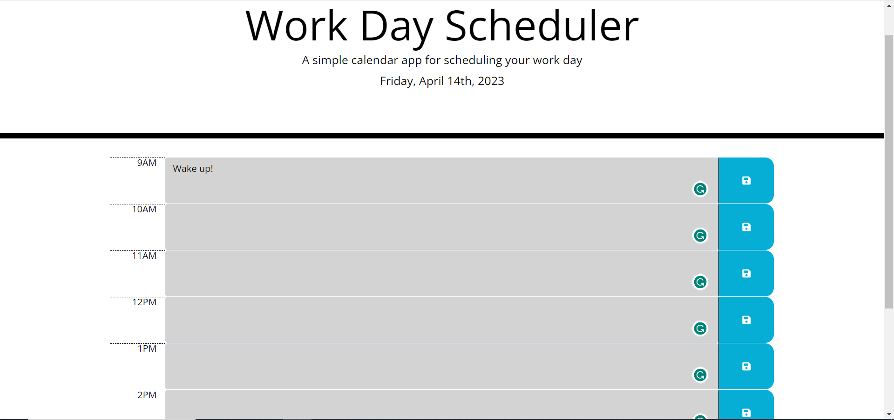

# 05-Challenge Awesome Epic Work Day Scheduler

## Description

This challenge was to create time blocks on a calendar app that users could input their day to day activities which will be saved using local storage. The time blocks change color based on real date and time using moment.js.

## Screenshot

## Link

https://tylerjohnsonhockey.github.io/05-Awesome-Epic-Calendar/